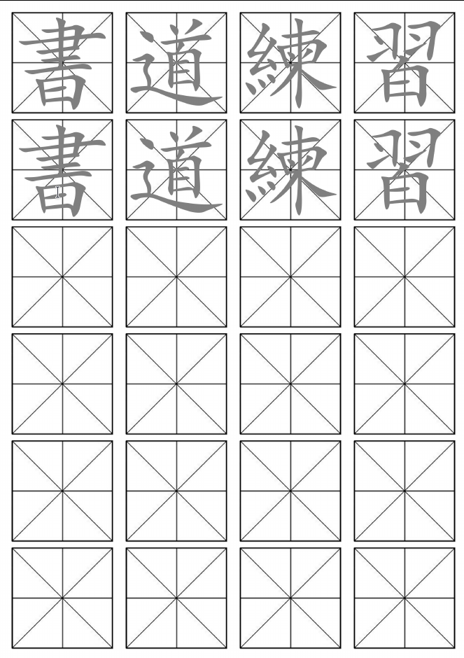

# Chinese practice sheet generator
Create custom practice sheets for chinese/japanese calligraphy.

# Installation
Pillow library for python3 is requiered
```bash
pip3 install pillow
```

# Usage
```
usage: grid_gen.py [-h] [--repeat-rows REPEAT_ROWS] [--margin-size MARGIN_SIZE] kanji
positional arguments:
  kanji                 The chinese characters (without spaces between).

optional arguments:
  -h, --help            show this help message and exit
  --repeat-rows REPEAT_ROWS, -n REPEAT_ROWS
                        Number of rows of traceable characters.
  --margin-size MARGIN_SIZE, -msize MARGIN_SIZE
                        Number of rows of traceable characters.
```

# Example
The following command
```bash
python3 grid_gen.py 書道練習 -msize 60 -n 2
```
generates:


